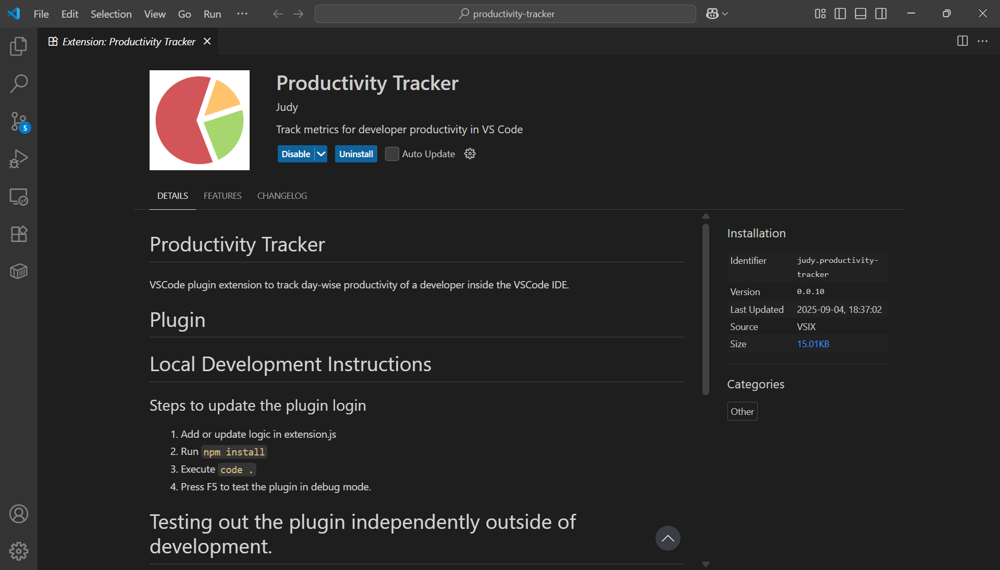
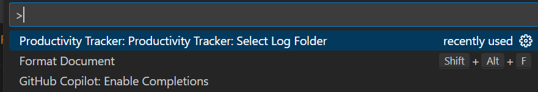
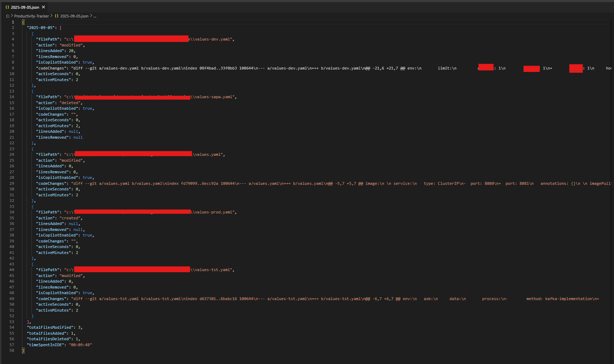

# Productivity Tracker
VSCode plugin extension to track day-wise productivity of a developer inside the VSCode IDE.

# Plugin

## Extension installed

## Setting the log file path (Optional for Windows)
1. Press `Ctrl+Shift+P`
2. Select this option

3. Select the folder location where you want the log files to be stored.
Note: Step 2 and 3 are optional. Default location is set to `C:/Productivity-Tracker`

## Saved Logs

# Local Development Instructions

## Steps to update the plugin login
1. Add or update logic in extension.js
2. Run `npm install`
3. Execute `code .`
4. Press F5 to test the plugin in debug mode.

# Testing out the plugin independently outside of development.

## Compile the plugin

1. Make some changes to the code, update the version in the package.json and Run `npm install`
2. Run `npx vsce package`
3. This will generate a plugin with name -> `productivity-tracker-version.vsix`

## Import the plugin.

1. Click on the extensions in VSCode.
2. Click on view and more options.
3. Import the vsix plugin from the saved location.

## Verify the plugin

1. Open any code repository or folders.
2. Update the code, every 1 minute and during the IDE exit, the productivity logs saved in `C:Productivity-Tracker` in updated as a day-wise .json file.

